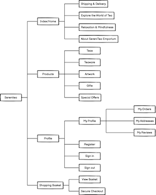
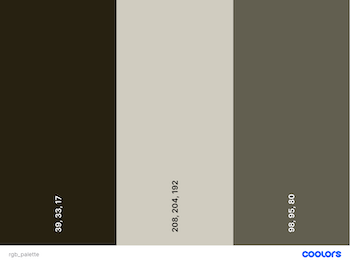

<h1 align="center">SereniTea Emporium</h1>
 
<p align="center"> This repository and the accompanying Full Stack Web Application is presented for Code Institute Milestone Project 4.</p>


<p align="center">
    
</p>

<p align="center"> 
  <a href="https://mp4-serenitea-emporium-5454dc22e46f.herokuapp.com/" target="_blank">Visit SereniTea Emporium on Heroku</a>
</p>

<p align="center">
  <!-- GitHub Last Commit -->
  
  <!-- GitHub commit activity -->
  
  <!-- GitHub language count -->
  
  <!-- Website Status -->
  
</p>

- - -

## Table of Contents

- [Introduction](#Introduction)
- [User Experience (UX)](#User-Experience-(UX))
  - [Project Goals](#Project-Goals)
  - [Strategy](#Strategy)
  - [Scope](#Scope)
  - [Structure](#Structure)
  - [Skeleton](#Skeleton)
  - [Surface](#Surface)
- [Site Development](#Site-Development)
  - [Data Management](#Data-Management)
  - [Site Content](#Site-Content)
  - [User Management using Allauth](#User-Management-using-Allauth)
  - [Tools & Technologies](#Tools-&-Technologies)
- [Site Functionality](#Site-Functionality)
  - [Responsive Site Navigation](#Site-Navigation)
  - [Product Search Facility](#Product-Search-Facility)
  - [Application Walkthroughs](#Application-Walkthroughs)
- [Testing](#Testing)
- [Guide to Development and Deployment](#Guide-to-Development_and-Deployment)
- [Project Review and Reflection](#Project-Review-and-Reflection)
  - [Improvements to Design and Development](#Improvements-to-Design-and-Development)
  - [Future Features](#Future-Features)
  - [Challenges and Bugs](#Challenges-and-Bugs)
- [Project Credits and Acknowledgements](#Project-Credits-and-Acknowledgements)

- - -

## Introduction
This repository and the associated deployed website comprise my submission for the Diploma in Web Development, Milestone Project 4. 
The purpose of this project is to demonstrate ability to design and develop a Full Stack Web Application in the form of an e-commerce site, implemented using the Django framework with appropriate associated technologies and APIs (including Python, HTML, CSS and JavaScript).


<kbd>[Return to ToC](#Table-of-Contents)</kbd>
- - -

<p align="center">
  
</p>

## User Experience (UX)
The focus of this project and the developed full stack web application is the SereniTea Emporium, a fictional store specializing in the sale of loose leaf teas and related paraphernalia. 
The underlying mission of the company is to promote positive mental health through peace, relaxation and serenity. This is reflected in the company name and the products selected for sale through the store.

The intended users of this web application are as follows:
- Site administrator, maintaining the application on behalf of the store owner.
- Store customers, visiting the site to browse for, order and pay for desired products.
- Casual site visitors, exploring the site to learn more and potentially become a store customer.


### Project Goals
The primary goal of this project is to design, develop and deploy an e-commerce site for SereniTea Emporium. This project will adopt a full stack approach to development, from the front end interactive web site to the back end data storage ('data at rest'), transfer ('data in motion') and manipulation ('data in use').


### Strategy
<!-- What are we aiming to achieve, and for whom? -->
This e-commerce application is developed as the online presence of a (fictional) store that specializes in selling loose leaf teas and tea-related/themed products directly to non-commercial customers. The UX needs to consider the ethos of the company, promoting wellbeing and relaxation, and maintaining an ethical business model (supporting local producers and artists and using biodegradable packaging). The intended users of the site will be the store owner and administrators (managing the store), store customers (purchasing products) and casual website visitors (learning more about the company before becoming a customer).

### Scope
<!-- What features do we want to include in the design? What's on the table, and whats off (for now)? -->
The scope of this project is the design, build and deployment of a full stack online e-commerce application. It will include the ability for customers to browse a product catalogue, add products to a basket and securely pay for a basket of items once shopping is complete. Site visitors will be able to create a user profile to save their details to enable faster checkout (for customers) and controlled feature access (for customers and site administrators). It will also, however, enable anonymous checkout for customers who do not want to create an account.
At the back-end it will include full CRUD functionality for one or more aspects of the site, specifically allowing site administrators to add, edit and delete store products.


#### Site Users

Three distinct users have been identified for this web application:
- ***Casual Site Visitors***: Individuals who may have arrived at the site through recommendations, internet search results, or links from other sites. These are those people who have not yet become a customer.
- ***Store Customers***: Individuals who have explored the store and decided to become a customer, either through making a purchase or just registering for a user account. These are typically returning site visitors - casual site visitors who have been converted into customers.
- ***Site Administrators***: Those maintaining the backed elements, in particular the product catalogue and user profiles.


In future the '***Store Owner***' would be added as another distinct user. This would entail the expansion of the system to include additional user stories relating to stock control monitoring and reporting, sales tracking and reporting, and site usage reporting to support store management decisions and actions. This area is outside scope of this version of the site and so these user requirements (stories) have not been included.


#### User Stories
The user stories for SereniTea have been organised into 6 activity areas:
- [A. Visiting the Site](#A-Visiting-the-Site)
- [B. Store Browsing and Navigation](#B-Store-Browsing-and-Navigation)
- [C. Searching and Sorting](#C-Searching-and-Sorting)
- [D. User Registration and Accounts](#D-User-Registration-and-Accounts)
- [E. Purchasing and Checkout](#E-Purchasing-and-Checkout)
- [F. Store Management](#F-Store-Management)


##### A. Visiting the Site
| User Story ID | As a ... | I want to be able to ... | So that I can ... |
|---------------|-----------|------------------------|-----------------|
| A.1 | Visitor | Understand the purpose of the site immediately upon visiting | Decide whether to stay on the site and become a shopper.|
| A.2 | Visitor | Visit a site with a recognisable interface| Quickly and easily recognise the site in my bookmarks and when revisiting it in future    |
| A.3 | Visitor | Use a responsive website| View and use the site on a variety of devices |
| A.4 | Visitor | Learn about the company| Make an informed decision whether or not to make a purchase |
| A.5 | Visitor | Find the company on social media| Learn more and keep up to date on products, offers, etc. |
| A.6 | Visitor | Contact the company | Get answers to any queries that I may have |
| A.7 | Visitor | Receive feedback when using the site| Know if my actions have been successful, without cluttering the site with additional text |

##### B. Store Browsing and Navigation
| User Story ID | As a ... | I want to be able to ... | So that I can ... |
|---------------|-----------|------------------------|-----------------|
| B.1 | Customer | Easily and intuitively navigate the site | Find what I'm looking for without using the browser buttons |
| B.2 | Customer | View all products available | Select products for purchase. |
| B.3 | Customer | View specific category of products | Browse all items of interest without having to look through all store products. |
| B.4 | Customer | View all products in a group of related categories | Browse selection of items of potential interest, without having to look through all store products or each individual category. |
| B.5 | Customer | View details of individual products | See price, description and image of product and learn more about the individual products. |
| B.6 | Customer | See item reviews | Make an informed decision about what items to purchase. |
| B.7 | Customer | Easily see all store offers | Take advantage of any special offers and discounts on products I'm considering purchasing. |
| B.8 | Customer | Easily see limited edition items | Consider purchasing limited edition/special products whilst they're available. |

##### C. Searching and Sorting
| User Story ID | As a ... | I want to be able to ... | So that I can ... |
|---------------|-----------|------------------------|-----------------|
| C.1 | Customer | Sort all products into order | Easily identify the best priced and highest  rated products, and sort according to product name. |
| C.2 | Customer | Sort products per category into order | Easily identify the best priced and highest  rated products per category, and sort items in each category by name. |
| C.3 | Customer | Search for items by name or description | Quickly find specific items that I'm interested in |
| C.4 | Customer | Easily see the results of my search and my search criteria | Quickly see if the item I'd like are available for purchase |


##### D. User Registration and Accounts
| User Story ID | As a ... | I want to be able to ... | So that I can ... |
|---------------|-----------|------------------------|-----------------|
| D.1 | Customer | Register for a user account | Have a personal profile page for this online store |
| D.2 | Customer | Log in and out of my account | Securely access my account information |
| D.3 | Customer | Recover my password | Regain access to my account if I lose my password |
| D.4 | Customer | Receive an email confirmation when I've registered for an account  | Verify that my account registration has been successful |
| D.5 | Customer | Have a personalised user profile | Save personal information for faster checkout |
| D.6 | Customer | Update my user profile | Keep my personal details up to date |
| D.7 | Customer | See my order history | Remind myself of previous products I've purchased       |

##### E. Purchasing and Checkout
| User Story ID | As a ... | I want to be able to ... | So that I can ... |
|---------------|-----------|------------------------|-----------------|
| E.1  | Customer | Easily add items I want to purchase to my shopping basket | Ensure I purchase the correct items |
| E.2  | Customer | View current items in my shopping basket | Keep track of the items I'd like to purchase |
| E.3  | Customer | Easily update the contents of my shopping basket | Update quantity of items in my bag before checkout |
| E.4  | Customer | Delete items from my shopping basket | Remove items I don't want to purchase before checkout |
| E.5  | Customer | Easily view the total cost of my current purchases | Keep track of my spending and not spend too much |
| E.6  | Customer | See shipping cost of basket contents | Keep track of my spending |
| E.7  | Customer | See how much I need to spend to get free shipping | Take advantage of free shipping offer |
| E.8  | Customer | Complete checkout securely | Pay for items whilst knowing that no-one has access to my personal payment details |
| E.9  | Customer | Enter my payment information | Purchase the items in my shopping bag |
| E.10 | Customer | View order confirmation after checkout | Ensure the purchase has been successful |
| E.11 | Customer | Receive and email confirmation after completing checkout process | Retain confirmation for my records. |
| E.12 | Customer | Use my saved profile details during checkout | Quickly purchase items without having to re-enter my details |
| E.13 | Customer | Purchase products without having to create an account | Avoid having to sign up to the store. |

##### F. Store Management
| User Story ID | As a ... | I want to be able to ... | So that I can ... |
|---------------|-----------|------------------------|-----------------|
| F.1 | Site Admin | Add a product | Add a new product to the items for sale through my store |
| F.2 | Site Admin | Edit/Update a product | Change product prices, details, images and other relevant information |
| F.3 | Site Admin | Delete a product | Removed items from the store that are no longer for sale              |
| F.4 | Site Admin | See number of items of products in stock | Monitor stock levels to re-order as needed |
| F.5 | Site Admin | Ensure no orders are placed for out of stock items | Be confident that the store can complete all submitted orders |

### Structure
<!-- How is the information structured, and is it logically grouped? -->
The site structure according to functionality and features (not strictly mapped to site pages) is shown in the Site Structure figure.
All data relating to the data models will be stored by Django in the online Postgres database ElephantSQL. The structure of this backend database is illustrated in the Entity Relationship Diagram (ERD) below.


<p align="center">
  <a href="docs/design/initial-site-structure.png" target="_blank">
    
  </a>
<br>
<em>Figure: Overview of Site Structure</em>
</p>

The site structure diagram was created with future development in mind. As such it includes sections outside the initial scope - customer reviews a page about tea and a page about relaxation & mindfulness.

<p align="center">
  <a href="docs/design/serenitea-data-model.jpg" target="_blank">
    
  </a>
<br>
<em>Figure: Relational Database Schema (ERD)</em>
</p>

As well as defining the initial entities (models) relating to customers, orders and products, the database schema also includes the reviews entity. Being outside scope this hasn't yet been developed, but the Django app and resulting model will be based on this schema.

### Skeleton
<!-- How the information should be implemented, and how the user will navigate through the info/features -->

Site pages will be constructed dynamically based session data and user actions, using a ```base.html``` template file and a variety of page templates that expand upon it, supported by python scripts and Jinja2 templating.
From the perspective of the site visitor however it will appear to be comprised of a number of distinct pages:

- Information Pages
  - Home / Welcome Page
  - About Page
  - Shipping & Delivery:
- Store Contents
  - Products page: for viewing gallery of products
  - Product page: for viewing the details of each individual product
- Shopping Basket:


#### Site Navigation
The design of this site will enable visitors to navigate around the store without using the browser buttons, but using the following site facilities:

- A responsive navigation bar to access product categories, accessible at the top of the page or, on smaller viewports, via an off-canvas side menu.
- A navigation bar at the top of every page providing access to user profile, shopping basket and search facility.
- Page footer links to information pages, in addition to being available via the off-canvas menu.
- Guiding site buttons, enabling the visitor to view the product catalogue and *keep shopping*.


#### Error Handling
Error handling will be provided throughout to ensure that user engagement is not interrupted by functional or runtime errors (or at least minimized). This error handling will be implemented as follows:

- Keeping the user informed: The user will be kept informed of actions and results via the messages bar near the top of the screen. This message bar wil be used to confirm to the site user when items have been added to their basket, when their basket has been updated and when an order has been placed. It will also however display messages when something has gone wrong, such as a failed payment or if an issue has arisen trying to add a product to their basket.

- Out of Scope Functionality: Until all future functionality is completed, some elements of the site will not be active. Although these are outside the scope of this project, these may cause an issue to visitors of the initial site. As such, where a page is not yet available in the site a bespoke ```404 - Page Not Found``` page has been added to the project.

#### Wireframes

All wireframes were built upon an initial base design, comprising a standard header containing site navigation bar and offers carousel and a standard page footer.

<p align="center">
  <a href="docs/design/wireframes/home.png">
  </a>
<br>
<em>Figure: Home Page Wireframe</a></em>
</p>
<br>
<p align="center">
  <a href="docs/design/wireframes/home-menus.png">
  </a>
<br>
<em>Figure: Site Menus Wireframe</a></em>
</p>
<br>
<p align="center">
  <a href="docs/design/wireframes/all-products.png">
  </a>
<br>
<em>Figure: Store Products listing Wireframe - with a selected product group of 'Teas'</a></em>
</p>
<br>
<p align="center">
  <a href="docs/design/wireframes/product-items-general.png">
  </a>
<br>
<em>Figure: Product details page Wireframe - general products</a></em>
</p>
<br>
<p align="center">
  <a href="docs/design/wireframes/product-items-teas.png">
  </a>
<br>
<em>Figure: Product details page Wireframe - teas</a></em>
</p>
<br>
<p align="center">
  <a href="docs/design/wireframes/shopping-basket.png">
  </a>
<br>
<em>Figure: Shopping Basket Wireframe</a></em>
</p>
<br>
<p align="center">
  <a href="docs/design/wireframes/about.png">
  </a>
<br>
<em>Figure: Company 'About' page Wireframe</a></em>
</p>
<br>


#### Django Structure and Apps

*Table: Application Apps*

| Name     | Description|
| ---------- | ----------- |
| 📂 ```Home``` | Main site homepage, plus additional pages 'about' and 'shipping'|
| 📂 ```Basket``` | Shopping basket is populated with products as customer adds and removes products during store browsing.<br/>Includes page to view the contents of the current shopping basket.<br/>Basket contents are saved in session variable, which is deleted when the customer closes their browser. |
| 📂 ```Checkout``` | App to add payment details and delivery address, then process payment to obtain projects.<br/>Includes Stripe payment, Stripe webhooks, and order confirmation email.|
| 📂 ```Products``` | Store products, plus the facility to view all products, sort and search products, and inspect the details of each individual product.<br/>Also includes pages for a superuser to add new products to the catalogue and edit existing products.|
| 📂 ```Profiles``` | Enable site visitors to view their user profile, along with a full history of placed orders. |

<br>

*Table: Additional site folders*

| Name      | Description|
| --------- | ------- |
| 📂 ```Media``` | Store for all site images, including product images.|
| 📂 ```Serenitea``` | The main site folder containing Django settings and URLs|
| 📂 ```Static``` | Site stylesheet and icon|
| 📂 ```Templates``` | Resources used across the site:<br/>- 📂 ```allauth```: all allauth templates to be employed by Django to provide common user interaction functions, such as creating accounts, login authorisation, and resetting passwords.<br/>- 📂 ```includes```: Main (top) navigation menu & products menu, for both large and mobile devices<br/>- 📰 ```base.html```: The foundation page which is used by all apps to ensure consistency across the site.<br/>- 📰 ```404.html```: Tailored 'page not found' error page |


### Surface
The surface design decisions were made on consideration of keeping the interface simple, intuitive, with colors associated with relaxation and teas.

#### Site Icons
[Bootstrap icons](https://icons.getbootstrap.com/ "Bootstrap Icons") was employed as the source of all site icons. Icons were selected to assist user navigation by using familiar images, including a shopping basket, person outline for the user access/profile, and edit and delete icons.

#### Site Colors
The initial site logo was developed using [ImageFX](https://aitestkitchen.withgoogle.com/tools/image-fx "ImageFX") generative AI tool. After tweaking the text description a number of times, a suitable logo was generated. The final color palette was then created by using [Coolors](https://coolors.co/ "Coolors color palette generator") to generate palette suggestions based on the final logo color.

<p align="center">
  <a href="docs/design/colors/color_palette_collage.jpg">
  </a>
<br>
<em>Figure: Site color palette</a></em>
</p>
<br>
<p align="center">
  <a href="docs/design/colors/rgb_palette.png">
  </a>
<br>
<em>Figure: RGB codes for site colors</a></em>
</p>
<br>
<p align="center">
  <a href="docs/design/colors/black-on-timberwolf.png">
  </a>
<br>
<em>Figure: Site accordion and text containers - Black (#000;) on Timberwolf (#d0ccc0;)</a></em>
</p>
<br>
<p align="center">
  <a href="docs/design/colors/bistre-on-timberwolf.png">
  </a>
<br>
<em>Figure: Site footer - Bistre (#272111;) on Timberwolf (#d0ccc0;)</a></em>
</p>
<br>
<p align="center">
  <a href="docs/design/colors/black-on-white-small.png">
  </a>
<br>
<em>Figure: Other site text, including titles, navbar and site buttons - Black (#000;) on White (#fff;)</a></em>
</p>
<br>


#### Typography
Two fonts were selected for use across the site:

- Yeseva One: A soft, elegant and clean serif font, selected for use in site headers.
- Montserrat: A sans-serif font, selected for general site content due to being crisp and readable on smaller viewports.

[Google Fonts](https://fonts.google.com/) was then used as the source of these fonts for the deployed site.

<br>
<p align="center">
  <a href="docs/design/fonts/google-fonts.png">
  </a>
<br>
<em>Figure: Font selection</a></em>
</p>
<br>


#### Accessibility
Site accessibility was considered throughout the design, development and testing process. This was guided by [W3C ARIA guidelines](https://www.w3.org/WAI/ARIA/apg/ "ARIA Guidelines"), [MDN](https://developer.mozilla.org/en-US/docs/Web/Accessibility/ARIA "ARIA Guidelines"), and the in-built Accessibility checker in Google's Chrome tools.

<kbd>[Return to ToC](#Table-of-Contents)</kbd>


- - -

<p align="center">
  
</p>  

- - -

## Site Development

In the following section we look at the key areas of decisions and actions relating to developing the web application, according go the designs and approaches covered above.

### Data Management
The defined relational database schema was constructed in the online Postgres database [ElephantSQL](https://www.elephantsql.com/). The process of populating and updating the database was then supported by using teh Django framework.

### Site Content
<!-- Generation of data for the site -->

The data for SereniTea Emporium was primarily produced using AI tools:
- Product Descriptions - [ChatGPT (v3.5)](https://chatgpt.com/)
- Product Images - [ImageFX](https://aitestkitchen.withgoogle.com/tools/image-fx)
- SereniTea Store Descriptions/Text - [ChatGPT (v3.5)](https://chatgpt.com/)

These tools were used to enable a good selection of products to be included in the store, without adversely affecting the time available for the milestone project.

#### Populating the Product Catalogue

The following describes the process for generating product catalogue data:
  1. Create set of product category definitions and export to csv file [categories.csv](docs/product-catalogue/categories.csv)
  2. Write initial product title and brief description
  3. Use description as input into [ChatGPT](https://chatgpt.com/) to generate full product description
  4. Review and edit text as required
  5. Use initial description [ImageFX](https://aitestkitchen.withgoogle.com/tools/image-fx) to generate potential images
  6. Repeat image generation process until appropriate image created (complementary to other image styles in the current image set)
  7. Add all product details and image urls to a spreadsheet
  8. Spreadsheet autogenerates sku, (non-friendly) name and image filenames
  9. Export data to csv file [products.csv](docs/product-catalogue/products.csv)
  10. Convert csv files to Django fixtures json format using python scripts

  - [makeJsonCategories.py](docs/product-catalogue/makeJsonCategories.py) --> [categories.json](docs/product-catalogue/categories.json)
  - [makeJsonProducts.py](docs/product-catalogue/makeJsonProducts.py) --> [products.json](docs/product-catalogue/products.json)
  
  11. Add fixture files to the product app fixture folder
  12. Finally, add the json fixture files into the project using the following CLI commands:
  ```
  python3 manage.py loaddata categories
  python3 manage.py loaddata products

  ```

#### Producing Site Text

Some site text was also generated using AI.

  1. Write initial brief description of text requirement (for example 'description of an online store selling loose leaf teas and accessories, focussed on relaxation and wellbeing)
  2. Use description as input into [ChatGPT](https://chatgpt.com/) to generate candidate site text
  3. Review and edit text, using it as a basis for creating the final site text.


### User Management using Allauth
Django Allauth version 0.60.0 was used in the SereniTea project to support user management, authorization and authentication.

Within the project html files the block named ```content``` was used to wrap the page specific content:
```
  
    <page-specific content>
  
```

Due to allauth template files also using the block name ```content```, some modifications needed to be made to the allauth templates to enable them to be used in this project.

The three [main base allauth 0.60.0 templates](https://docs.allauth.org/en/latest/common/templates.html) customized for use are as follows:

  - ```base.html```      <-- The overall base template for allauth pages
  - ```entrance.html```  <-- The entrance template, extending the base template
  - ```manage.html```    <-- The account management template, extending the base template

These files were modified as follows:
The block ```content``` section was updated to use the SereniTea container format, followed by an ```allauth_inner_content``` block for the inclusion of allauth-specific code:
```
  
    <page-specific content>
  
```

In addition, above this element was placed a block to contain the page heading, to ensure the page heading is placed and styled consistently across all pages:
```
  
  
```

Throughout the allauth files used in this project, the ```content``` block was renamed to ```allauth_inner_content``` and page-specific header information included in a ```allauth_inner_content_heading``` block.

- Registration
  - ```signup.html```
  - ```verification_sent.html```
- User access
  - ```login.html```
  - ```logout.html```
- Password management
  - ```password_reset.html```
  - ```password_reset_done.html```
  - ```password_set.html```
  - ```password_change.html```
- Email Mamagement:
  - ```email_confirm.html```
  - ```email_change.html```

### Tools & Technologies
Below is a summary of the tools and languages used during this project, from design through to development and testing.

#### Coding
- [Django v4.2](https://www.djangoproject.com/ "Django"): The Web Framework underpinning this Full Stack Web Application.
- [Python](https://www.python.org/ "Python.org"): Used to provide the majority of the backend functionality.   
- [JavaScript](https://www.w3schools.com/js/js_intro.asp "JavaScript Introduction, W3Schools") & [jQuery](https://jquery.com/ "jQuery"): These were used to add additional functionality to the site, including adding interactivity to some of the site pages. 
- [Django-allauth v0.60](https://docs.allauth.org/en/latest/index.html "allauth"): For the provision of user access functionality, including site registration, signin and logout.
- [Stripe](https://stripe.com/gb "Stripe"): The Stripe payment mechanism was employed in the backend to process payments, used in 'Test Mode' to ensure no payments can actually be taken from any visitors.

#### Markup Languages
- [HTML](https://www.w3schools.com/html/html_intro.asp "HTML Introduction, W3Schools"): The standard web page markup language for constructing static web pages.
- [Jinja2](https://jinja.palletsprojects.com/en/3.1.x/ "Jinja Templating Engine"): This templating language was used to enable dynamic data modifications across the site pages.
- [Markdown](https://en.wikipedia.org/wiki/Markdown "Markdown overview, Wikipedia"): Use to produce project documentation, including this README.

#### Styling
- [Bootstrap 5.3.3](https://getbootstrap.com/ "Bootstrap"): The Bootstrap toolkit was used for site layout and styling.
- [Bootstrap Icons](https://icons.getbootstrap.com/ "Bootstrap Icons"): The course for all icons used across the site.
- [CSS](https://www.w3schools.com/css/css_intro.asp "CSS Introduction, W3Schools"): Additional styling was added to the site using CSS.
- [Google Fonts](https://fonts.google.com/ "Google Fonts"): The source for the fonts used across the site - [Yeseva One](https://fonts.google.com/specimen/Yeseva+One "Yeseva One @ Google Fonts") and [Montserrat](https://fonts.google.com/specimen/Montserrat "Montserrat @ Google Fonts")
- The pairing of Yeseva One and Montserrat fonts was inspired by a suggestion from [####](####).
- Site color palette was developed using [####](####).

#### Tools
This section lists the tools used during this project in support of the development and deployment stages.
- [Balsamiq Wireframes](####): Used to create the initial site wireframes during the design stage, to guide the development stage.
- [Diagrams.net](https://app.diagrams.net/ "diagrams.net/draw.io"): This free online drawing tool (previously known as draw.io) was used to create the entity relationship diagram (ERD), describing the underlying data storage (postgres database) model.
- [ElephantSQL](https://www.elephantsql.com/ "ElephantSQL"): The 'PostgreSQL as a Service' relational database management system (RDBMS) used to store site data, as defined by the ERD.
- [Visual Studio Code](https://code.visualstudio.com/ "VSCode"): All code was developed using a local installation of VS Code. (Code Institute development tools were not used during this project)
- Git & [GitHub](####): Git used for version control, with GitHub being employed as the online repository for all project work.
- [ImageFX](https://aitestkitchen.withgoogle.com/tools/image-fx "ImageFX"): Generative AI tool, used to create al product and site images.
- [ChatGPT v3.5](https://chatgpt.com/ "ChatGPT-3.5"): Generative AI tool, used to create initial draft of all product descriptions and site text.
- [Coolors](https://coolors.co/ "Coolors color palette generator"): used to generate site color palette based on site logo.
- [Tinyfy](https://tinypng.com/ "Tnyfy - compress your images"): Used to optimize site images to reduce download time.
- [10MinEmail](https://temp-mail.org/en/10minutemail "TempMail"): Used to obtain free, time-limited temporary email addresses for testing user actions.
- [Heroku](https://www.heroku.com/ "Heroku"): The Heroku platform has been used in this project to host the final, [deployed web site](https://mp4-serenitea-emporium-5454dc22e46f.herokuapp.com/ "Serenitea Emporium").

#### Testing and Validation
Testing and Validation tools used throughout the development and testing stages include the following:
- [Google Chrome Developer Tools](https://developer.chrome.com/docs/devtools "DevTools"): Used throughout development to support page design, testing and accessibility. 
- [Multi Device Website Mockup Generator](https://techsini.com/multi-mockup/) and [AmIResponsive](https://ui.dev/amiresponsive "Bytes AmIResponsive"): Used to test UI responsiveness across a number of device sizes.

All other tools employed during the Testing and Validation stage, are listed in the accompanying document [TESTING.MD](docs/TESTING.MD).


<kbd>[Return to ToC](#Table-of-Contents)</kbd>


- - -

<p align="center">
  
</p>  

- - -


## Site Functionality

This section provides an overview of web application functionality. 

Information Pages - Home/Landing, About Serenitea, Shipping & Delivery

User access - Account Registration, Sign In, Sign Out, Profile Page

Store Products - All Products, Product Category, Product Details

Superuser Product Management - All Products, Product Details, Edit Product, Add New Product

Shopping Basket - Shopping Basket, Checkout Process, Checkout Completed


### Responsive Site Navigation

The top menu/navigation bar is responsive across users and device sizes.

#### Mobile devices

<br>
<p align="center">
  <a href="docs/design/colors/black-on-white-small.png">
  </a>
<br>
<em>Figure: Other site text, including titles, navbar and site buttons - Black (#000;) on White (#fff;)</a></em>
</p>
<br>


<br>
<p align="center">
  
<br>
<em>Figure: Top navigation bar on mobile devices</em>
</p>
<br>

<br>
<p align="center">
  
<br>
<em>Figure: Off-canvas navigation bar on mobile devices</em>
</p>
<br>

<br>
<p align="center">
  
<br>
<em>Figure: User account menu on mobile devices</em>
</p>
<br>

#### Desktop devices

<br>
<p align="center">
  
<br>
<em>Figure: Top navigation bar on desktop devices</em>
</p>
<br>

<br>
<p align="center">
  
<br>
<em>Figure: Products navigation on desktop devices</em>
</p>
<br>

<br>
<p align="center">
  
<br>
<em>Figure: User account menu on desktop devices</em>
</p>
<br>


### Site Search Facility

Like the navigation system, the site search facility is also responsive across users and device sizes.

#### Mobile devices

<br>
<p align="center">
  
<br>
<em>Figure: Search facility on mobile devices</em>
</p>
<br>

<br>
<p align="center">
  
<br>
<em>Figure: Search results screen on mobile devices</em>
</p>
<br>

#### Desktop devices

<br>
<p align="center">
  
<br>
<em>Figure: Search facility on desktop devices</em>
</p>
<br>

<br>
<p align="center">
  
<br>
<em>Figure: Search results screen on desktop devices</em>
</p>
<br>

### Application Walkthroughs
 A selection of application walkthroughs, demonstrating functionality and features, can be found in [WALKTHROUGHS.MD](docs/WALKTHROUGHS.MD)

<kbd>[Return to ToC](#Table-of-Contents)</kbd>
- - -

## Testing

Full overview and results of site testing can be found in [TESTING.MD](docs/TESTING.MD).

<kbd>[Return to ToC](#Table-of-Contents)</kbd>
- - -

## Guide to Development and Deployment

Guidance for how to use the SereniTea Emporium project repository for undertaking further development or deploying the application to Heroku can be found in [DEPLOYMENT.MD](docs/DEPLOYMENT.MD).

<kbd>[Return to ToC](#Table-of-Contents)</kbd>

- - -

<p align="center">
  
</p>  

- - -

## Project Review and Reflection
There are a number of areas where this project could be improved, and where the site can (and will) be developed further.

### Improvements to Design and Development

#### Defensive Programming
Currently the side administrator (superuser) is able to edit product details and delete products with a single click. Site functionality could be improved by adopting a more defensive approach to coding by including checks, asking users to actively confirm deletions and edits.
The same approach would be adopted for registered site visitors editing their profile details.


#### Project Structure
Organize project MEDIA folders to separate product images from general site images (such as backgrounds), rather than the current approach of storing all images in the same folder. This would be undertaken in order to also support responsive images.


#### Responsive Images
The most significant issue with the current implementation is with product image management.
Currently all product images are saved in jpeg format, with a single image saved for each product. As such, the product database saves a single image full name for each product. For example, a product image attribute for a product named *Yorkshire Tea* would currently be ```yorkshire_tea.jpg```. This decision was made during the early design stage as a simple solution to storing product images.

There are a number of issues with this approach:
- More appropriate image formats are available, for smaller device screens, to reduce network capacity requirements and therefore reduce page load times.
- This approach doesn't allow for thumbnail, page-sized and larger (product zoom) images, each sized according to the page requirements.

This approach is therefore inefficient, and adversely impacts site performance. An important future development is therefore to
- store images in a more appropriate format: such as WebP;
- allow for multiple image sizes: thumbnail, large/zoomed, and 'standard' product images according to viewport size and managed using media queries; 
- include a function to automatically generate these images from a single image when a new product is added to the catalogue.

In future:

1. Product image names will be stored in the database without explicit file extension. Eg, ```yorkshire_tea.jpg``` would be saved as just ```yorkshire_tea```. This allows for multiple file formats and sizes to be generated, then used as appropriate using different name postfix additions (```_thumbnail``` ```_bs_sm``` ```_bs_xl``` etc) and extensions (```.webp``` ```.jpg```).

2. Product images would be initially added in jpeg or png formats. Alternative images would then be created automatically using a to-be-developed function to convert and resize, as far as possible (for example, a small image wouldn't be enlarged, but a large image could be reduced).

3. WebP images would be served by changing the current img tags from the current approach to static jpeg serving:

```

```

to a responsive approach:
```
<picture>
	<source type="image/webp" srcset="yorkshire_tea.webp">
	<source type="image/jpeg" srcset="yorkshire_tea.jpg">
	
</picture>
```
This approach uses 'picture' to allow for multiple image options, with source tags listing the potential images with the first available being the one that's served. The img tag would then only be used as the last resort, for when no other images exist, or when the browser doesn't support the responsive approach.

More details regarding this approach can be found at [web.dev - Use WebP Images](https://web.dev/articles/serve-images-webp).


#### Improved Security
Site security is currently controlled by user roles, with superusers/administrators being permitted greater access that standard visitors and customers. This includes the ability to add new products to the store catalogue.
In this initial version of the store application, product descriptions are stored in the database in HTML form, which is then rendered in the product detail page when selected for viewing.
As such, the 'add product' form allows for entry of a HTML formatted item description.

If access security was breached, this would allow for malicious code injection attacks whereby code could be sent to the database ([SQL Injection](https://owasp.org/www-community/attacks/SQL_Injection "OWASP - SQL Injection")) and/or executed when the specific product detail page is loaded ([XSS](https://owasp.org/www-community/attacks/xss/ "OSAWP - XSS")). 
An important future development would therefore be to sanitize data input to remove all code elements to remove this security weakness.

Improving security would be of high priority if this site were developed further and deployed as a fully functional e-commerce store, being essential to complete before store launch.


### Future Features
As can be seen in the Testing section, there are a number of areas where the current implementation of the site could be developed further and therefore improved. The features listed below are in addition to those previously listed future developments, and have been identified as those that would add greatest benefit to the site if implemented within the next development stage.


#### Confirmation of product deletion 
This feature is currently missing from the current version of this web application.

When a store administrator (system superuser) deletes a product from the store catalogue, clicking 'delete' should result in the user being asked 'Are you sure you want to delete this product?'. This is important to stop accidental deletions, as once deleted the product details have gone. 
Due to time constraints this wasn't added to the current version of this web application. This would therefore need to be added in a future development stage.

#### Product and Company Reviews
To improve communication with visitors and customers, as well as customer engagement, the first significant development would be the inclusion of customer-written, dynamic product (and company) reviews. This would include the following:
- Enable registered users to write and submit product reviews, editable until published to the site and visible to site visitors via the associated product details page. Optional customer images of store products could be added.
- Additional facility for site administrators to review and approve customer-written product reviews (with the option to publish immediately without any review), and remove any inappropriate reviews from the site.
- Calculate product rating scores dynamically based on customer-entered star ratings, rather than using static star ratings stored in the backend database.

#### User Profile Improvements
The current approach to customer access and profile management could also be developed further:
- Extending the account login system to allow for login using social media identity authentication (oauth).
- Enable registered users to add a profile image to their user profiles.

#### Additional Site Pages
- Add an autogenerated site map to provide an overview for site visitors.
- A contact page containing a validated form, enabling visitors to send a message directly to the company from the web site.
- Additional information pages based on the company ethos and product range. The text content for some of these pages have already been generated, although implementation of these pages was outside scope for the project timescale [About Leaf Teas](docs/additional-store-information-pages/leaf-tea.txt), [About Organic Tea](docs/additional-store-information-pages/organic-leaf-tea.txt), [The Benefits of Drinking Tea](docs/additional-store-information-pages/benafits-of-drinking-tea.txt), and [The Serenitea Art Collection](docs/additional-store-information-pages/serenitea-artwork-collection.txt).

#### Improved Navigation, using Breadcrumbs
Navigating the site could be made easier for visitors with the inclusion of [Breadcrumbs](https://getbootstrap.com/docs/5.3/components/breadcrumb/ "Bootstrap Breadcrumbs"). These would provide site visitors with a clearer pointer to their location in the site and, in particular, the product catalogue.

#### Improved Site Messages
Site messages are currently displayed in a message bar at the top of the page, under the offers carousel. This has been included to ensure visitors receive messages regardless of whether they have blocked site popups. In a future development this would be updated to be included only where popups are blocked, with toasts or other popups being used when the browser permits them. This decision has been made to support user browsing security.

Site messages will also be color-coded according to the type of notification being raised (success, error, etc).

#### Position of page footer and top navigation bar
Ideally, 
1. the footer should be at the bottom of every page, then stick the the bottom of the viewport window when the page doesn't fill the complete window, and
2. the top navigation bar should stick to the top of the viewport window, remaining there as the site visitor scrolls down the page.

At present, these two elements are positioned at the top and bottom of the page, being positioned according to the page size and page scrolling. Fixed and Sticky positioning will be employed in future to improve site usability (minimizing scrolling).


### Challenges and Bugs
The following issues are still present in this application:

#### BUG: Adding a product
When adding a product with a product image, the image is initially available and displayed in the product page. However, this is not persistent. After a while the image is lost. 

I suspect this may be due to Heroku saving it in cache, then clearing it after some time.
I also suspect this could be rectified by including an improved file storage option, such as AWS, or deploying the site to another platform with supports dynamic file storage.

#### CHALLENGE: Deployment & AWS
Deployment of the site through Heroku was problematic. I decided early on to try to use the most current versions possible of tools, packages and libraries in this project to expand my learning. However, this appears to have resulted in a situation where the course instructions for deployment do not work.

Several days were spent trying to debug the Heroku build errors using the Django, Heroku and AWS documentation, StackOverflow, and experimentation.
Although some errors arose with incompatibility of package versions (in particular - ```django``` and ```boto3```), linking Heroku, Django and AWS was particularly problematic. 

A compromise was reached for package incompatibilities by downgrading Django from version 5. 

No solution was found for incorporating AWS within the available time limit. Instead, [WhiteNoise](https://whitenoise.readthedocs.io/en/latest/WhiteNoise) was used to enable Django use of static files for the purpose of deploying this project. 

#### BUG: Failing to render 404
A tailored ```404 - Page Not Found``` html page has been created and added to the templates folder, to be displayed by Django in place of its standard 404 page. Unfortunately (and ironically), this is not currently functional.
This would be a good feature to include to ensure when there is an error the site informs the visitor politely that something has happened and provides them with a mechanism for returning to the home page. However, adding this to the live site has not been moved to a future development stage, along with the creation of other HTTP error handlers.


<kbd>[Return to ToC](#Table-of-Contents)</kbd>
- - -

## Project Credits and Acknowledgements

### Site Media
The following sites were used to obtain/generate visual site content:
- Google [fonts](https://fonts.google.com/) have been used across the site.
- All site icons are from Bootstrap [icons](https://icons.getbootstrap.com/).
- Product images were AI generated using [ImageFX](https://aitestkitchen.withgoogle.com/tools/image-fx)
- Product descriptions and site text creation was drafted using[ChatGPT (v3.5)](https://chatgpt.com/)
- Additional images obtained from [Pixabay](https://pixabay.com/) are free to use under their [Content License](https://pixabay.com/service/license-summary/).

### Additional Code and Resources
- Inspiration for site button styling was taken from [Slider revolution](https://www.sliderrevolution.com/resources/css-button-hover-effects/). 
- Information badges at top of README created using [Shields.io](https://shields.io/).

### Learning Resources
The following resources were used to develop coding skills, in addition to the Code Institute learning materials:
  - [Django 4.2](https://docs.djangoproject.com/en/4.2/) online documentation, for guidance on setting up and using the Django framework, along with the [Django Github Repo](https://github.com/django/)
  - [Django allauth](https://docs.allauth.org/en/latest/) online documentation, for tailoring and using the authentication modules
  - [Django crispy forms](https://django-crispy-forms.readthedocs.io/en/latest/) documentation, to learn how to use the latest version (5.0) in Django forms
  - [Django Clearable File Input Widget](https://github.com/django/django/blob/main/django/forms/templates/django/forms/widgets/clearable_file_input.html) documentation, for implementing the file input element in the Add/Edit Product page.
  - [Stripe](https://docs.stripe.com/) online documentation, in particular the [Getting Started](https://docs.stripe.com/get-started), [Payment APIs](https://docs.stripe.com/payments/payment-intents) and [Webhooks](https://docs.stripe.com/payments/handling-payment-events) sections, in developing the checkout app,
  - [Jinja](https://jinja.palletsprojects.com/en/3.1.x/) templating engine documentation, for building dynamic web page content
  - [Bootstrap 5.3](https://getbootstrap.com/docs/5.3/) online documentation, for styling the project website
  - [Heroku](https://github.com/heroku) github repo, for guidance and examples regarding deploying django and python.

General accessibility guidance was obtained from :
  - [W3C ARIA guidelines](https://www.w3.org/WAI/ARIA/apg/) for general guidance
  - [MDN](https://developer.mozilla.org/en-US/docs/Web/Accessibility/ARIA) for ARIA roles and descriptions

Development of the project markdown files were supported through reference to the following resources:
  - GitHub's [Writing on GitHub](https://docs.github.com/en/get-started/writing-on-github) documentation
  - Kera Cudmore's [Readme Examples](https://github.com/kera-cudmore/readme-examples/blob/main/milestone1-readme.md) for Code Institute Diploma Students
  - Adam Pritchard's [Markdown Cheatsheet](https://github.com/adam-p/markdown-here/wiki/Markdown-Cheatsheet)

Approach taken to testing was supported by the following:
- Guidance on using the three Lighthouse modes (user flows) was obtained from Google Chrome's [Lighthouse documentation](https://github.com/GoogleChrome/lighthouse/blob/HEAD/docs/user-flows.md)


### Inspiration
- The primary inspiration behind this project was Code Institute's Boutique Ado project. This greatly supported my learning and heavily influenced the design and development of the SereniTea Emporium project.
- The idea of an online tea store was inspired by [Jing Tea](https://jingtea.com/) and [Whittard UK](https://www.whittard.co.uk/)


### Acknowledgements
I would like to acknowledge the following people who helped me complete this milestone project:
- The Code Institute Slack community, in particular my fellow students in the feb-2023-pla cohort. 
- [Amy Richardson](https://code-institute-room.slack.com/team/U06CZC2JZTN) - our Code Institute cohort facilitator, for her support and encouragement throughout this project.
- [Jubril Akolade](https://github.com/Jubrillionaire) - my Code Institute mentor,m for their support, guidance and advice.
- Dr N. Caine - for his support and advice, particularly with regard to converting site data into JSON format and testing approaches to project deployment.


<kbd>[Return to ToC](#Table-of-Contents)</kbd>

- - -

<p align="center">
  
</p>  

- - -
