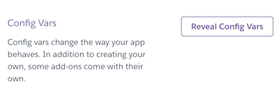
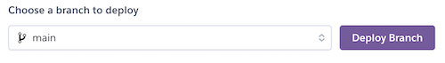
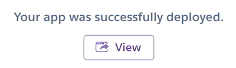

  

<h1 align="center">Deploying SereniTea Emporium</h1>

> A Guide to Development and Deployment

This section describes how to use the SereniTea project repository for undertaking further local development or deploying the site to Heroku.

- - -

## Local Development

To be able to deploy this application to your local environment, or to use it as a basis for further development, the source code can be obtained from GitHub.

#### How to Fork this Project Repo
1. Log in (or sign up) to Github.
2. Navigate to the [project repository](https://github.com/mikiburgess/MP4-SereniTea).
3. Click the Fork button at the top right of the page.

#### How to Clone this Project Repo
1. Log in (or sign up) to GitHub.
2. Navigate to the [project repository](https://github.com/mikiburgess/MP4-SereniTea).
3. Click on the Code button, and select the Local tab.
4. Select whether you would like to clone with HTTPS, SSH or GitHub CLI.
5. Copy the link shown by clicking the 'copy' button.
6. Open the  in your code editor and change the current working directory to the location you want to use for the cloned directory.
7. Type the command 'git clone' into the terminal and then paste the link you copied from GitHub. 
8. Press enter. You will now have a clone of the project repo.

#### Code Packages and Libraries
In order to expand this app, or deploy locally, make sure to refer to [requirements.txt](../requirements.txt) to ensure the correct software packages and libraries are available for use.

<kbd>[Return to Top](#Deploying-SereniTea-Emporium)</kbd>

- - -

## Deployment to Heroku
This project was deployed using [Heroku](https://www.heroku.com/). The instructions to achieve this are below:

On your local machine:
1. Open a command line/terminal window within the main project folder. 
2. Create a requirements.txt file by typing `pip3 freeze --local > requirements.txt` at the command line. 
3. Create a Procfile by typing `echo web: python app.py > Procfile` 
4. Add and commit these files to Github.

Go to [Heroku](https://www.heroku.com/). Log in or create an account
1. Click the 'New' button and click 'Create new app'.
2. Enter a unique name for your project with no capital letters or spaces and select the region closest to you (e.g., Europe). Click 'Create App'.
3. Inside the dashboard for your new app, go to the 'Settings' tab. 
4. Scroll down and click 'Reveal Config Vars' then enter data for the following variables:
    - `SECRET_KEY : ...`  <-- Secret key for use by Django
    - `DATABASE_URL : ...`  <-- URL for your application database
    - `EMAIL_HOST_USER : ...`  <-- Email address for the site
    - `EMAIL_HOST_PASS : ...`  <-- Password for app access, obtained from email provider
    - `STRIPE_PUBLIC_KEY : ...`  <-- Public Key obtained from Stripe
    - `STRIPE_SECRET_KEY : ...`  <-- Secret Key obtained from Stripe
    - `STRIPE_WH_KEY : ...`  <-- Secret key for Stripe webhook use

    
 
<em>Figure 1: Heroku Config Variables</em>

5. Link Github repo to Heroku by navigating to the Deploy tab. Select 'GitHub, enter the name of the repository and click connect. 

    
 
<em>Figure 2: Connecting to GitHub</em>

6. Once connected, select the repo branch to deploy (e.g. main) then click the Enable Automatic Deployment option.

    
 
<em>Figure 3: Selecting the branch to deploy</em>

To deploy immediately, in the Manual Deploy section again select the branch you want to deploy and click Deploy Branch. This will retrieve the code from GitHub. Once this is complete you'll receive a message "Your app was successfully deployed." You can then click "View" to access the deployed app.

    
 
<em>Figure 4: Successful deployment</em>

<kbd>[Return to Top](#Deploying-SereniTea-Emporium)</kbd>

- - -
