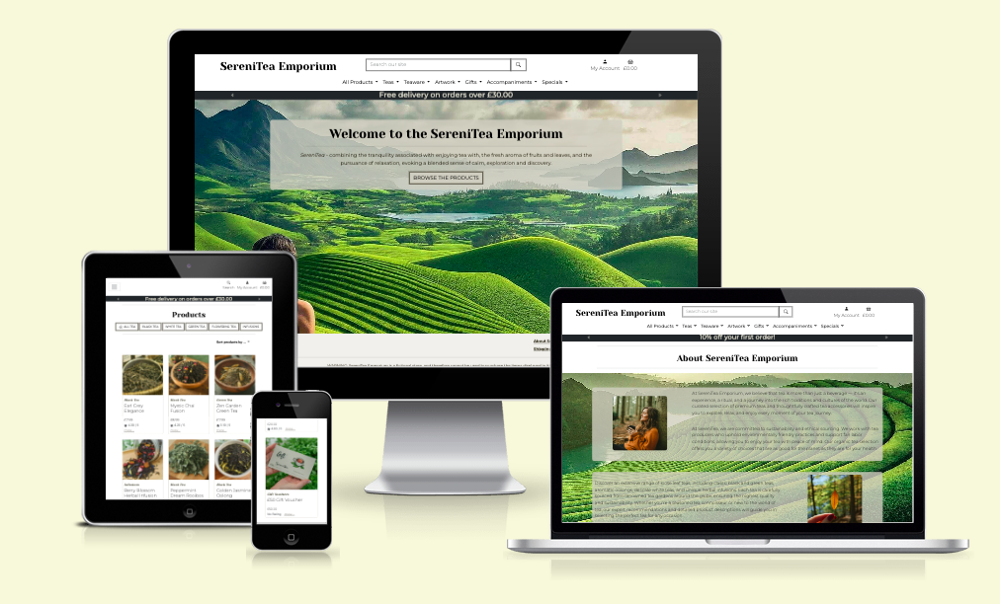

<h1 align="center">Application Testing</h1>

This document provides an overview of the testing of Milestone Project 4 - the SereniTea Emporium full stack web application project.

- - -
## Table of Contents

   - [Introduction](#Introduction)
   - [Browser Compatibility](#Browser-Compatibility)
   - [Site Responsiveness](#Site-Responsiveness)
   - [Code Validation](#Code-Validation)
   - [Lighthouse Testing](#Lighthouse-Testing)
   - [User Stories](#User-Stories)
   - [Features](#Features)
   - [Issues](#Issues)

- - -

## Introduction

This document describes the testing process and results for Milestone Project 4. For additional project details please refer to:

- [Main project README document](../README.MD)
- [Deployed e-commerce web application](https://mp4-serenitea-emporium-5454dc22e46f.herokuapp.com/)

<kbd>[Return to ToC](#Table-of-Contents)</kbd>

- - -

## Tools

- [Google Chrome Developer Tools](https://developer.chrome.com/docs/devtools "DevTools"): Used throughout development to support page design, testing and accessibility. 
- [Multi Device Website Mockup Generator](https://techsini.com/multi-mockup/) and [AmIResponsive](https://ui.dev/amiresponsive "Bytes AmIResponsive"): Used to test UI responsiveness across a number of device sizes.

## Browser Compatibility

Browser compatibility testing was completed with Chrome, Firefox, Safari and Opera, running on a MacBook. Edge and IE were not tested at this stage due to lack of access to those browsers. Before professional site deployment, compatibility would need to be tested on Windows-specific and a selection of mobile-specific browsers.

*Table 1: Browser responsiveness test results*

| | CHROME | FIREFOX | SAFARI | OPERA | Notes | 
| ----------- | ----------- | ----------- | ----------- | ----------- | ----------- 
| Intended appearance? | ok | ok | ok | ok | No issues identified |
| Intended responsiveness? | ok | ok | ok | ok | No issues identified |

<kbd>[Return to ToC](#Table-of-Contents)</kbd>

- - -

## Site Responsiveness

Responsiveness tests were undertaken using [Google Chrome Developer Tools](https://developer.chrome.com/docs/devtools "DevTools") and the online tools [Responsive Design Checker](https://responsivedesignchecker.com/), [Multi Device Website Mockup Generator](https://techsini.com/multi-mockup/) and [AmIResponsive](https://ui.dev/amiresponsive "Bytes AmIResponsive").
All tests were conducted using a MacBook.

    
     
    <em>Figure: Result of running deployed e-commerce application through <a href="https://ui.dev/amiresponsive" target="_blank">AmIResponsive</a></em>

Due to lack of access to multiple devices, all device responsiveness tests were completed using the [Google Chrome DevTools simulation tool](https://developer.chrome.com/docs/devtools/device-mode/). Before professional site deployment, responsiveness would need to be tested on real devices.

- - -

## Code Validation

### Direct File Input

*Table 2: Code Validation*

| App      | File               | Tool              | Result |
|----------|--------------------|-------------------| ----- |
| Basket   | views.py | CI Python Linter  | [No issues](testing/code-validation/basket-views_py.png) |
| Checkout | stripe-elements.js | JSHint            | [Warning](testing/code-validation/checkout-stripe_elements_js.png) that template literals are only avaialble in ES6. Code would therefore need to be updated before official store launch. |
| Checkout | views.py | CI Python Linter  | [Import line too long](testing/code-validation/checkout-views_py.png). To comply with PEP8 good practice this shold be reduced to 79 characters (max) |
| Checkout | webhook-handler.py | CI Python Linter  | [Three lines too long](testing/code-validation/checkout-webhook_handler_py.png). To comply with PEP8 good practice these should be reduced to 79 characters (max) |
| Checkout | webhooks.py | CI Python Linter  | [No issues](testing/code-validation/checkout-webhooks_py.png) |
| Home     | views.py | CI Python Linter  | [No issues](testing/code-validation/home-views_py.png) |
| Products | views.py | CI Python Linter  | [One line (search query) too long](testing/code-validation/products-views_py.png). To comply with PEP8 good practice this should be reduced to 79 characters (max) |
| Products | admin.py | CI Python Linter  | [No issues](testing/code-validation/products-admin_py.png) |
| Products | forms.py | CI Python Linter  | [No issues](testing/code-validation/products-forms_py.png) |
| Profiles | profile.css | W3C CSS Validator | [No issues](testing/code-validation/profile-profile_css.png) |
| Profiles | views.py | CI Python Linter  | [No issues](testing/code-validation/profile-views_py.png) |
| Project  | base.css | W3C CSS Validator | [No errors](testing/code-validation/serenitea-base_css.png). [3 warninings](testing/code-validation/serenitea-base_css-warnings.png). Warnings flag intentional decisions and so haven't been changed. |

### Deployed Site
The site as [deployed to Heroku](https://mp4-serenitea-emporium-5454dc22e46f.herokuapp.com/) was validated using the [W3C Markup Validation Service](https://validator.w3.org/). 
The results of this validation, along withs creenshots of the results, are listed in the table below.

*Table 3: Deployed validation*

| Site Page| Results|
| ------ | ------ |
| Home page| [No issues](testing/code-validation/homepage.png) |
| View all products| [Issue identified with Image ID attributes](testing/code-validation/view-all-products.png) Duplicate 'product-img' id's due to every product currently being given the same id value when the page is generated. This was done to enable consistent styling across all project images.  Based on the experience of working on this project, a better solution to this would be to use classes only for styling. Due to time limitations this modification will be an element for future work. |
| View individual product | [No issues](testing/code-validation/view-individual-product.png) |
| About SereniTea | [No issues](testing/code-validation/about-serenitea.png) |
| Shipping | [One issue](testing/code-validation/shipping.png) Validator identified an extra div ending tag. Minor issue. Not corrected due to project deadline. Would be completed under future development.|
| Shopping Basket | [No issues](testing/code-validation/basket.png) Warning that 'type' attribute is unnecessary for javascript elements. Decision made to leave it for clarity.|
| Checkout | Due to the personalised nature of this page, validation of the live version was not possible with this tool. The code validated tries to access all product images rather than those actually present in a shopping basket. Illustration - when [adding a single product to the basket](testing/code-validation/basket-content.png) and inspecting [page source](testing/code-validation/basket-code.png) online a single 'product-img' ID is present in the code. However, the validator picks up 141 intances of the 'product-img' ID [(issue screenshot)](testing/code-validation/basket-validation.png). |

<kbd>[Return to ToC](#Table-of-Contents)</kbd>

- - -

