

  

<h1 align="center">Application Testing</h1>

This document provides an overview of the testing of Milestone Project 4 - the SereniTea Emporium full stack web application project.

- - -
## Table of Contents

   - [Introduction](#Introduction)
   - [Browser Compatibility](#Browser-Compatibility)
   - [Site Responsiveness](#Site-Responsiveness)
   - [Code Validation](#Code-Validation)
   - [Lighthouse Testing](#Lighthouse-Testing)
   - [User Stories](#User-Stories)
   - [Features](#Features)
   - [Issues](#Issues)

- - -

## Introduction

This document describes the testing process and results for Milestone Project 4. For additional project details please refer to:

- [Main project README document](../README.MD)
- [Deployed e-commerce web application](https://mp4-serenitea-emporium-5454dc22e46f.herokuapp.com/)

<kbd>[Return to ToC](#Table-of-Contents)</kbd>

- - -

  

  

- - -

## Tools

The following tools were used during the testing and validation of the SereniTea Emporium full stack e-commerce application:
- [Google Chrome Developer Tools](https://developer.chrome.com/docs/devtools "DevTools"): Used throughout development to support page design, testing and accessibility. 
- [Multi Device Website Mockup Generator](https://techsini.com/multi-mockup/) and [AmIResponsive](https://ui.dev/amiresponsive "Bytes AmIResponsive"): Used to test UI responsiveness across a number of device sizes.
- [W3C CSS Validation Service](https://jigsaw.w3.org/css-validator/): CSS stylesheet validation by direct input.
- [JSHint](https://jshint.com/): JavaScript validation by direct input.
- [CI Python Linter](https://pep8ci.herokuapp.com/): Python code validation by direct input.
- [W3C Markup Validation Service](https://validator.w3.org/): Validation of dynamically constructed and rendered HTML pages of the deployed application.

<kbd>[Return to ToC](#Table-of-Contents)</kbd>

- - -

## Browser Compatibility

Browser compatibility testing was completed with Chrome, Firefox, Safari and Opera, running on a MacBook. Edge and IE were not tested at this stage due to lack of access to those browsers. Before professional site deployment, compatibility would need to be tested on Windows-specific and a selection of mobile-specific browsers.

*Table 1: Browser responsiveness test results*

| | CHROME | FIREFOX | SAFARI | OPERA | Notes | 
| ----------- | ----------- | ----------- | ----------- | ----------- | ----------- 
| Intended appearance? | ok | ok | ok | ok | No issues identified |
| Intended responsiveness? | ok | ok | ok | ok | No issues identified |

<kbd>[Return to ToC](#Table-of-Contents)</kbd>

- - -

## Site Responsiveness

Responsiveness tests were undertaken using [Google Chrome Developer Tools](https://developer.chrome.com/docs/devtools "DevTools") and the online tools [Responsive Design Checker](https://responsivedesignchecker.com/), [Multi Device Website Mockup Generator](https://techsini.com/multi-mockup/) and [AmIResponsive](https://ui.dev/amiresponsive "Bytes AmIResponsive").
All tests were conducted using a MacBook.

    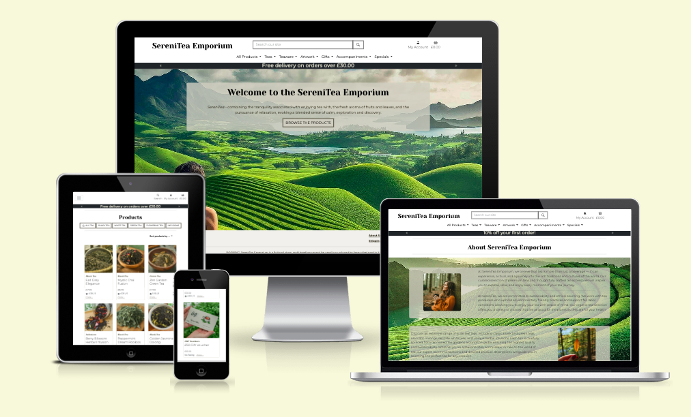
     
    <em>Figure: Result of running deployed e-commerce application through <a href="https://ui.dev/amiresponsive" target="_blank">AmIResponsive</a></em>

Due to lack of access to multiple devices, individual device responsiveness tests were simulated using the [Google Chrome DevTools simulation tool](https://developer.chrome.com/docs/devtools/device-mode/) and [Responsive Design Checker](https://responsivedesignchecker.com/). Before professional site deployment, responsiveness would need to be tested on real devices.

### Selection of results from the [Responsive Design Checker](https://responsivedesignchecker.com/)

- Mobile: 
    - [Google Pixel](testing/responsiveness/mobile-google-pixel.png)
    - [Apple iPhone 6](testing/responsiveness/mobile-iphone-6.png)
- Tablet: 
    - [Amazon Kindle Fire](testing/responsiveness/tablet-amazon-kindle-fire.png)
    - [Apple iPad Mini](testing/responsiveness/tablet-ipad-mini.png)
- Computer: 
    - [13 inch notebook](testing/responsiveness/computer-13-inch-notebook.png)
    - [20 inch desktop](testing/responsiveness/computer-20-inch-desktop.png)
    - [24 inch desktop](testing/responsiveness/computer-24-inch-desktop.png)

- - -

## Code Validation

Two approaches were adopted for code validation:
- *Direct File Input*: Where code was pasted into the online validation tool
- *Deployed Site*: Where the validator was provided with the URL of the deployed site.

### Direct File Input

*Table 2: Code Validation*

| *APP* | *FILE* | *TOOL* | *RESULT* |
|----------|------------|-------------| ----- |
| Basket   | views.py | CI Python Linter  | [No issues](testing/code-validation/basket-views_py.png) |
| Checkout | stripe-elements.js | JSHint | [Warning](testing/code-validation/checkout-stripe_elements_js.png) that template literals are only available in ES6. Code would therefore need to be updated before official store launch. |
| Checkout | views.py | CI Python Linter  | [Import line too long](testing/code-validation/checkout-views_py.png). To comply with PEP8 good practice this should be reduced to 79 characters (max) |
| Checkout | webhook-handler.py | CI Python Linter  | [Three lines too long](testing/code-validation/checkout-webhook_handler_py.png). To comply with PEP8 good practice these should be reduced to 79 characters (max) |
| Checkout | webhooks.py | CI Python Linter  | [No issues](testing/code-validation/checkout-webhooks_py.png) |
| Home | views.py | CI Python Linter  | [No issues](testing/code-validation/home-views_py.png) |
| Products | views.py | CI Python Linter  | [One line (search query) too long](testing/code-validation/products-views_py.png). To comply with PEP8 good practice this should be reduced to 79 characters (max) |
| Products | admin.py | CI Python Linter  | [No issues](testing/code-validation/products-admin_py.png) |
| Products | forms.py | CI Python Linter  | [No issues](testing/code-validation/products-forms_py.png) |
| Profiles | profile.css | W3C CSS Validator | [No issues](testing/code-validation/profile-profile_css.png) |
| Profiles | views.py | CI Python Linter  | [No issues](testing/code-validation/profile-views_py.png) |
| Project  | base.css | W3C CSS Validator | [No errors](testing/code-validation/serenitea-base_css.png). [3 warnings](testing/code-validation/serenitea-base_css-warnings.png). Warnings flag intentional decisions and so haven't been changed. |

### Deployed Site
The site as [deployed to Heroku](https://mp4-serenitea-emporium-5454dc22e46f.herokuapp.com/) was validated using the [W3C Markup Validation Service](https://validator.w3.org/). 
The results of this validation, along with screenshots of the results, are listed in the table below.

*Table 3: Deployed validation*

| *SITE PAGE* | *RESULTS* |
| ------ | ------ |
| Home page| [No issues](testing/code-validation/homepage.png) |
| View all products| [Issue identified with Image ID attributes](testing/code-validation/view-all-products.png) Duplicate 'product-img' id's due to every product currently being given the same id value when the page is generated. This was done to enable consistent styling across all project images.  Based on the experience of working on this project, a better solution to this would be to use classes only for styling. Due to time limitations this modification will be an element for future work. |
| View individual product | [No issues](testing/code-validation/view-individual-product.png) |
| About SereniTea | [No issues](testing/code-validation/about-serenitea.png) |
| Shipping | [One issue](testing/code-validation/shipping.png) Validator identified an extra div ending tag. Minor issue. Not corrected due to project deadline. Would be completed under future development.|
| Shopping Basket | [No issues](testing/code-validation/basket.png) Warning that 'type' attribute is unnecessary for javascript elements. Decision made to leave it for clarity.|
| Checkout | Due to the personalised nature of this page, validation of the live version was not possible with this tool. The code validated tries to access all product images rather than those actually present in a shopping basket. Illustration - when [adding a single product to the basket](testing/code-validation/basket-content.png) and inspecting [page source](testing/code-validation/basket-code.png) online a single 'product-img' ID is present in the code. However, the validator picks up 141 intances of the 'product-img' ID [(issue screenshot)](testing/code-validation/basket-validation.png). |

<kbd>[Return to ToC](#Table-of-Contents)</kbd>

- - -

## Lighthouse Testing
The [Lighthouse](https://developer.chrome.com/docs/lighthouse/overview/) tool in Google Chrome was used to test site performance, accessibility and best practice of the deployed application. An overview of the results of the Lighthouse testing are listed in Table 4, along with links to summary reports.

*Table 4: Lighthouse Testing Results*

| *PAGE* | *RESULT* | *REPORT* |
| :--- | :---: | :---: |
| Home page | 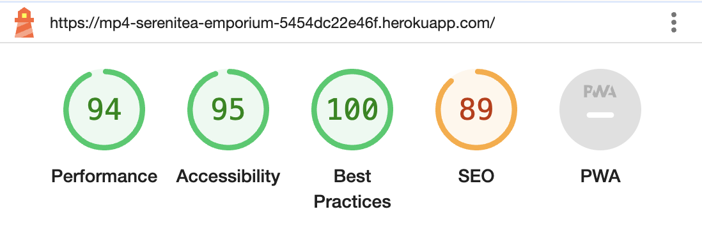 | [pdf](testing/lighthouse-reports/lighthouse-home-page.pdf) |
| About SereniTea | 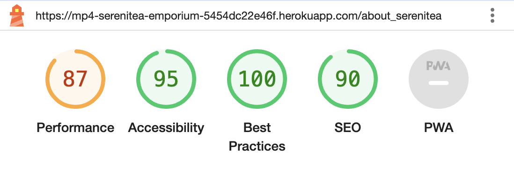 | [pdf](testing/lighthouse/summary-reports/lighthouse-desktop-about-summary.pdf) |
| All Products | 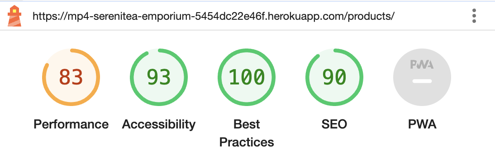 | [pdf](testing/lighthouse/summary-reports/lighthouse-desktop-products-summary.pdf) |
| Single product item - Gold Rim Mug | 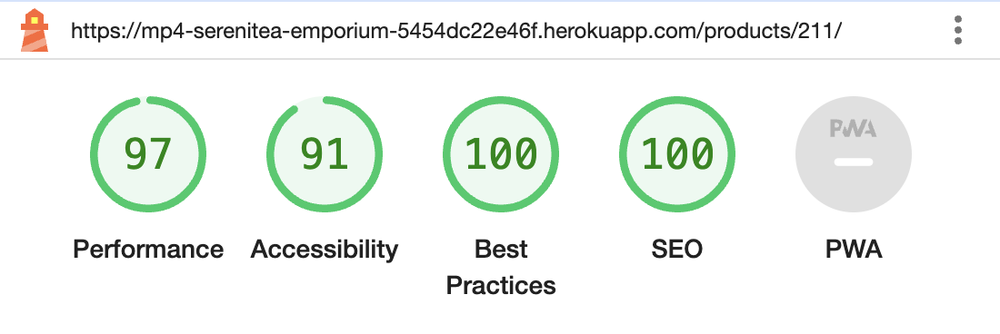 | [pdf](testing/lighthouse/summary-reports/lighthouse-desktop-product-gold-rim-mug-summary.pdf) |
| Single product item - Gold Assam Sunset Tea | 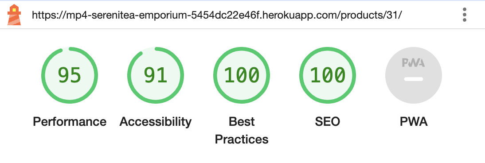 | [pdf](testing/lighthouse/summary-reports/lighthouse-desktop-product-golden-assam-sunset.pdf) |
| Single product item - Leaf Tea Selection Box | 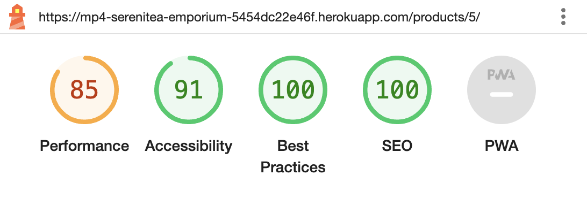 | [pdf](testing/lighthouse/summary-reports/lighthouse-desktop-product-leaf-tea-selection-box-summary.pdf) |
| Shopping Basket with 1 Item | 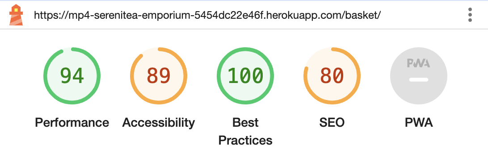 | [pdf](testing/lighthouse/summary-reports/lighthouse-desktop-basket-one-item-summary.pdf) |
| Shopping Basket with 4 Items | 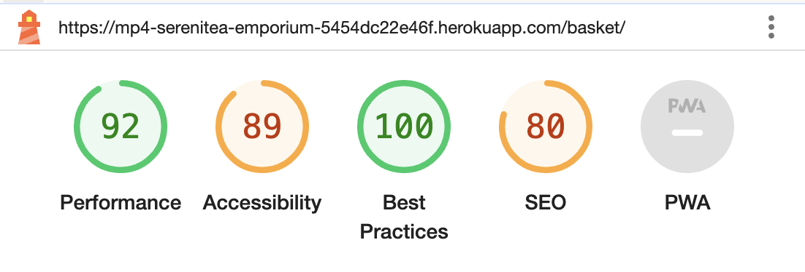 | [pdf](testing/lighthouse/summary-reports/lighthouse-desktop-basket-four-items-summary.pdf) |
| Checkout page | 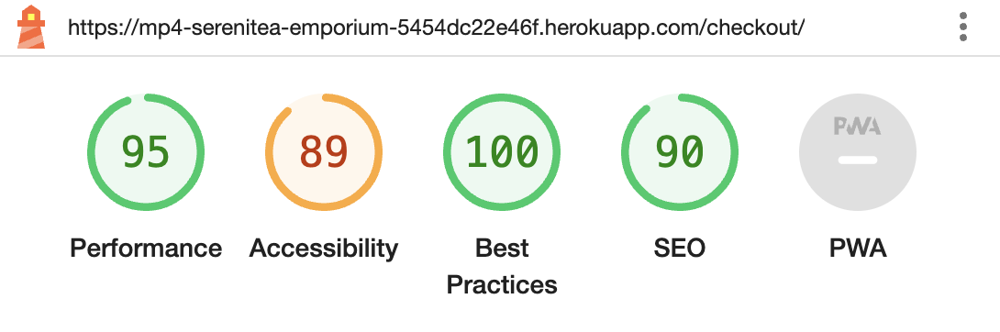 | [pdf](testing/lighthouse/summary-reports/lighthouse-desktop-checkout-summary.pdf) |
| Checkout Confirmation | 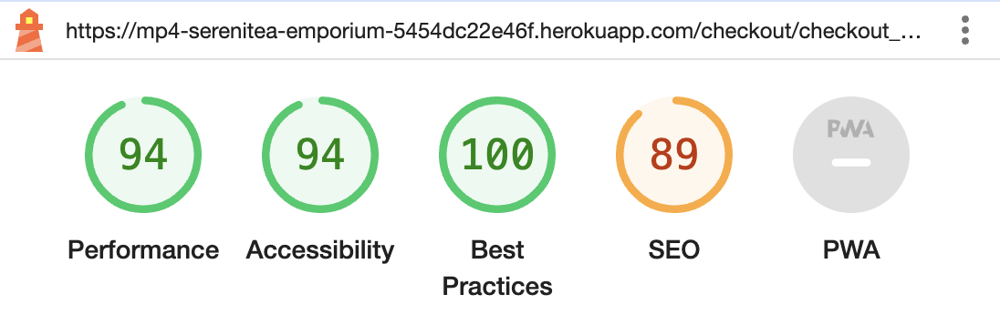 | [pdf](testing/lighthouse/summary-reports/lighthouse-desktop-checkout-success-summary.pdf) |

Table 4 shows the results of testing a selection of site pages, using the desktop views. A number of lessons have been learned and actions identified:

- Performance: Improve by enabling text compression and storing all images in next gen format (WebP). (This would significantly improve performance for mobile devices.)
- Accessibility: Improve by adding supportive text to links. 
- SEO: Could be improved by adding a more considered and comprehensive set of metadata.

The next development stage would include implementing these changes then repeating the above tests, and expanding the testing to also consider mobile performance.

<kbd>[Return to ToC](#Table-of-Contents)</kbd>

- - -

## Stripe Payments

In order to test the payment functionality, a selection of [Stripe simulated payment options](https://docs.stripe.com/testing?testing-method=card-numbers) were selected to test stripe integration with the SereniTea e-commerce site.

The results of these tests are presented in the following table.

*Table 5: Stripe Payment Testing*

| TEST| CARD NUMBER| CVC  | DATE  | EXPECTED RESULTS | TEST RESULT | EVIDENCE |
| ----- | ----- | ----- | ----- | ------ | ----- | ----- |
| Visa (credit) | 4242424242424242 | 123  | 02/25 | Payment Success | Order is successful and payment processed by stripe | [card](testing/stripe-payments/success-visacredit-cardinfo.png), [order](testing/stripe-payments/success-visacredit-order.png), [stripe](testing/stripe-payments/success-visacredit-stripe.png) |
| Visa (debit) | 4000056655665556 | 123  | 02/25 | Payment Success | Order is successful and payment processed by stripe | [card](testing/stripe-payments/success-visadebit-cardinfo.png), [order](testing/stripe-payments/success-visadebit-order.png), [stripe](testing/stripe-payments/success-visadebit-stripe.png) |
| Mastercard (credit) | 5555555555554444 | 123  | 02/25 | Payment Success | Order is successful and payment processed by stripe | [card](testing/stripe-payments/success-mastercard-cardinfo.png), [order](testing/stripe-payments/success-mastercard-credit-order.png), [stripe](testing/stripe-payments/success-mastercard-credit-stripe.png) |
| American Express | 378282246310005  | 1234 | 02/25 | Payment Success | Order is successful and payment processed by stripe | [card](testing/stripe-payments/success-amex-cardinfo.png), [order](testing/stripe-payments/success-amex-order.png), [stripe](testing/stripe-payments/success-amex-stripe.png) |
| United States (US) | 4242424242424242 | 123  | 02/25 | Payment Success | Order is successful and payment processed by stripe | [order](testing/stripe-payments/success-us-order.png), [stripe](testing/stripe-payments/success-us-stripe.png) |
| Norway (NO) | 4000005780000007 | 123  | 02/25 | Payment Success | Order is successful and payment processed by stripe | [order](testing/stripe-payments/success-no-order.png), [stripe](testing/stripe-payments/success-no-stripe.png) |
| United Kingdom (GB) | 5555558265554449 | 123  | 02/25 | Payment Success | Order is successful and payment processed by stripe | [order](testing/stripe-payments/success-gb-order.png), [stripe](testing/stripe-payments/success-gb-stripe.png) |
| Generic decline | 4000000000000002 | 123  | 02/25 | Declined | Payment declined with message "Your card has been declined." | [declined](testing/stripe-payments/generic-decline.png) |
| Insufficient Funds | 4000000000009995 | 123  | 02/25 | Declined | Payment declined with message "Your card has insufficient funds." | [declined](testing/stripe-payments/insufficient-funds.png) |
| Incorrect CSV | 4000000000000127 | 123  | 02/25 | Declined | Payment declined with message "Your card's security code is incorrect." | [declined](testing/stripe-payments/incorrect-csv.png) |
| Fraud Protection - Always Blocked | 4100000000000019 | 123  | 02/25 | Declined | Payment declined with message "Your card has been declined." | [declined](testing/stripe-payments/fraud-protection-always-decline.png) |
| Fraudulent | 4000000000000259 | 123  | 02/25 | Declined | Payment Intent succeeded. Order successful - confirmation [img](testing/stripe-payments/fraudulent-initial-success.png) with email [img](testing/stripe-payments/fraudulent-success-email.png) Stripe dispute raised, viewable in dashboard [img](testing/stripe-payments/fraudulent-stripe-dispute.png).  Payment eventually declined [img](testing/stripe-payments/fraudulent-funds-withdrawn-top.png) and withdrawn [img](testing/stripe-payments/fraudulent-funds-withdrawn-reason.png) | [Order Successful](testing/stripe-payments/fraudulent-initial-success.png) with [Email](testing/stripe-payments/fraudulent-success-email.png), [Stripe dispute](testing/stripe-payments/fraudulent-stripe-dispute.png), [Fund withdrawn](testing/stripe-payments/fraudulent-funds-withdrawn-top.png) with [Reason](testing/stripe-payments/fraudulent-funds-withdrawn-reason.png) |
| Always Authenticate - successful | 4000002760003184 | 123  | 02/25 | Payment Success when Authenticate | On placing the order the authentication notice is displayed. When clicking 'complete' the order is successful. | [card](testing/stripe-payments/authenticate-1-cardinfo.png), [authentication](testing/stripe-payments/authenticate-2-authentication-required.png), [order](testing/stripe-payments/authenticate-3-order.png), [stripe](testing/stripe-payments/authenticate-4-stripe.png) |
| Always Authenticate -0 declined | 4000002760003184 | 123  | 02/25 | Declined when Not Authenticated   | On placing the order the authentication notice is displayed. When clicking 'fail' the payment is declined. | [card](testing/stripe-payments/authfail-1-cardinfo.png), [authentication](testing/stripe-payments/authfail-2-authentication.png), [failed](testing/stripe-payments/authfail-3-clicked-fail.png), [stripe](testing/stripe-payments/authfail-4-stripe.png) |

<kbd>[Return to ToC](#Table-of-Contents)</kbd>

- - -

  

  

- - -

## User Stories

The initial user stories were revisited and evaluated. The results can be found in the accompanying [User Stories Table](testing/user-stories-table.md).

<kbd>[Return to ToC](#Table-of-Contents)</kbd>

- - -

## Features

Site features have been manually tested and are demonstrated in the accompanying WALKTHROUGH section.

<kbd>[Return to ToC](#Table-of-Contents)</kbd>

- - -

## Issues

The following tests could not be undertaken within the project timeframe, but would be completed in the next phase of development:

- User testing with a selection of volunteers, covering testing of anonymous and registered customers as well as obtaining feedback from a store owner (based on their experience of running a real-world store).
- Responsiveness testing using Google Chrome DevTools for simulated mobile devices.
- Lighthouse testing for mobile devices.
- Testing on a selection of physical devices.
- Additional testing of the Reviews app (not completed in full due to time constraints).
- Production of illustrations of testing results for each user story.
- Production of illustrations of testing site across a range of browsers.
- Inclusion of automated testing.

<kbd>[Return to ToC](#Table-of-Contents)</kbd>

- - -

  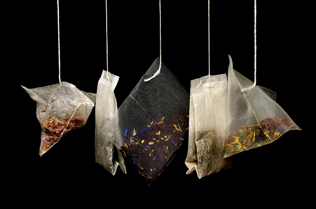

  

- - -